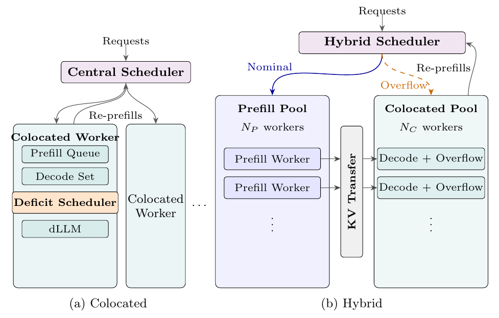

# Sangam

[](https://arxiv.org/abs/2607.04206)
[](https://huggingface.co/GSAI-ML/LLaDA-8B-Instruct)
[](https://huggingface.co/Dream-org/Dream-v0-Instruct-7B)

**Sangam** is an efficient serving system for diffusion language models (dLLMs). It systematically adapts the autoregressive (AR) LLM serving stack to dLLMs.

- **Serves bidirectional dLLMs out of the box** — LLaDA-8B and Dream-7B (with Fast-dLLM style KV caching). The models are not supported by AR serving engines such as SGLang and vLLM.
- **Fast execution** — Sustains roughly **2.5–3× higher load than Fast-dLLM** at matched latency on LLaDA-8B and Dream-7B (ShareGPT and arXiv traces). FlashInfer attention kernels and CUDA Graphs deliver raw per-token throughput comparable to SGLang.
- **Deficit token-budget scheduler** — Mitigates prefill-decode interference without chunked prefill which bidirectional attention precludes (see **(a)** below).
- **Colocated (a), disaggregated, and hybrid (conditional disaggregation) (b) execution** under a single implementation.
    <p align="left">
    
    </p>

## Setup

### Prerequisites

- Install [uv](https://docs.astral.sh/uv/getting-started/installation/)
- We have tested `sangam` with CUDA 12.8 on H100 GPUs.

### Installation

```bash
git clone https://github.com/UT-InfraAI/sangam.git
cd sangam
uv sync
```

## Quick Start

### Inbuilt benchmark 

1. First generate the arxiv length trace (see [scripts/traces/arxiv/README.md](scripts/traces/arxiv/README.md)).
2. Then start a small benchmark with an included test:
```bash
uv run python -m sangam.benchmark.main \
    --model GSAI-ML/LLaDA-8B-Instruct \
    --mode colocated \
    --gpus 0 \
    --num-requests 100 \
    --length-type trace \
    --length-trace-file data/traces/arxiv_summarization_llada2_tokenizer_filtered_4k.csv \
    --qps 1.0 \
    --output-dir benchmark_output
```
Use `--model Dream-org/Dream-v0-Instruct-7B` for the Dream-8B model.

### Submit your own Request

1. Start your server with:
```bash
uv run python -m sangam.entrypoints.launch \
    --model GSAI-ML/LLaDA-8B-Instruct \
    --mode colocated \
    --gpus 0 \
    --scheduler-port 50051
```
2.  See [scripts/submit_request.py](scripts/submit_request.py) for a minimal Python gRPC client example, and [docs/serving.md](docs/serving.md) for request fields, poll statuses, and serving troubleshooting.

## Tests

```bash
uv run pytest tests/
```
## Lint

```bash
uv run ruff check
```

## Format

```bash
uv run ruff format
```

## Documentation

- [Serving modes, request submission, and troubleshooting](docs/serving.md)
- [Benchmark harness, trace inputs, and outputs](docs/benchmarking.md)
- [Capacity search (max QPS under SLA)](docs/capacity-search.md)
- [Metrics emitted by sangam](docs/metrics.md)
- [Generating protobuf stubs and typings](docs/protobuf.md)

# Citation

If you use our work, please consider citing our paper:
```
@misc{kedia2026sangamefficientlyservingdiffusion,
      title={Sangam: Efficiently Serving Diffusion LLMs with the AR Stack}, 
      author={Nitin Kedia and Saurabh Agarwal and Myungjin Lee and Aditya Akella},
      year={2026},
      eprint={2607.04206},
      archivePrefix={arXiv},
      primaryClass={cs.DC},
      url={https://arxiv.org/abs/2607.04206}, 
}
```

# Acknowledgement
We used code such as PyTorch model definition files, caching and sampling from [Fast-dLLM](https://github.com/NVlabs/Fast-dLLM), and Huggingface repositories [LLaDA-8B-Instruct](https://huggingface.co/GSAI-ML/LLaDA-8B-Instruct) and [Dream-v0-Instruct-7B](https://huggingface.co/Dream-org/Dream-v0-Instruct-7B/tree/main).

# License
Sangam is released under the [Apache License 2.0](LICENSE). See the [NOTICE](NOTICE) file for third-party attributions.
